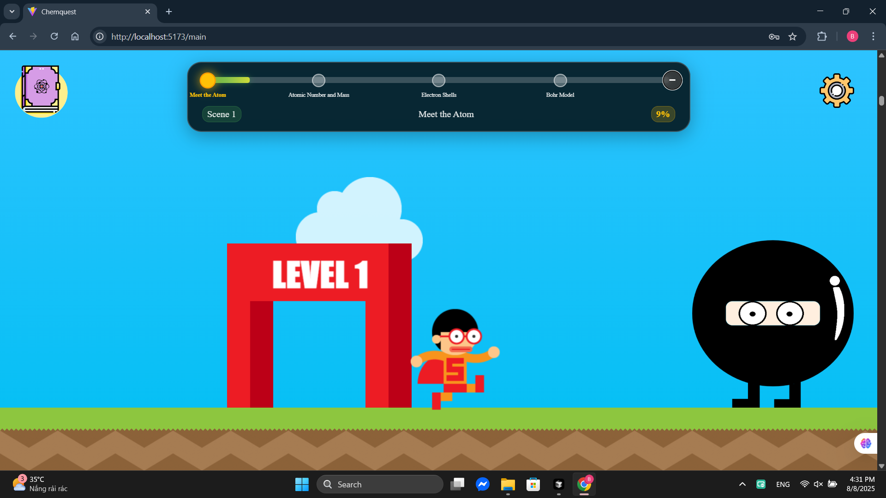
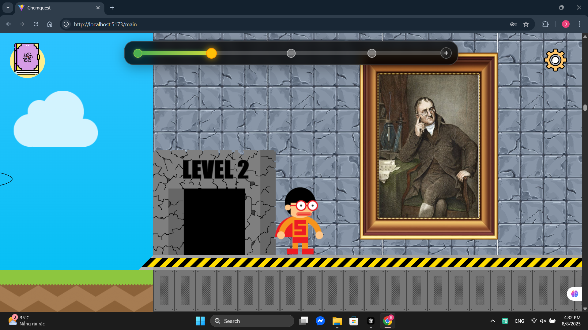
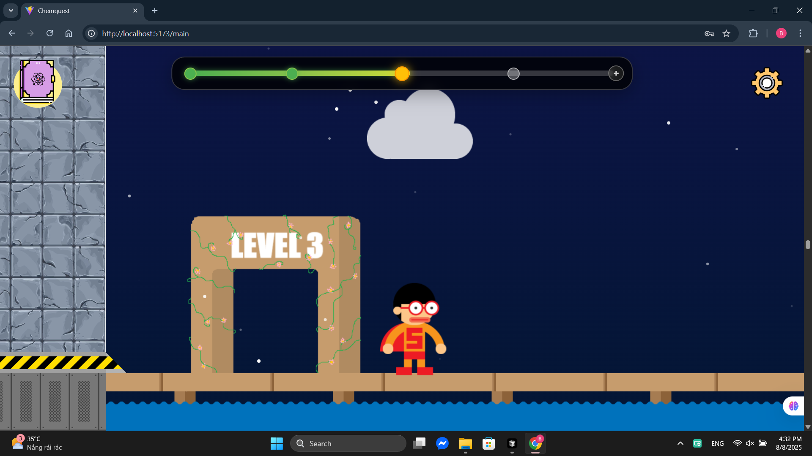
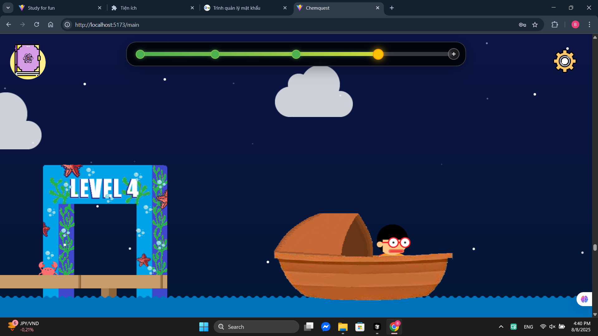

# Chemquest - Interactive Chemistry Learning Game

## 🧪 Overview

Chemquest is an immersive, interactive web-based educational game designed to teach chemistry concepts through engaging visual storytelling and gamified learning experiences. The game takes players on a journey through the microscopic world of atoms, making complex chemistry concepts accessible and enjoyable for learners of all ages.

## 🎮 Features

### Interactive Learning Experience
- **3D Atom Visualization**: Explore atoms with interactive 3D models using Three.js and React Three Fiber
- **Progressive Storytelling**: Navigate through multiple scenes with scroll-based storytelling
- **Interactive Elements**: Click on atomic particles (protons, neutrons, electrons) to learn about their properties
- **Mission-Based Learning**: Complete missions and challenges to progress through the game

### Educational Content
- **Atomic Structure**: Learn about protons, neutrons, and electrons
- **Interactive Quizzes**: Test knowledge with dynamic quiz questions from a MySQL database
- **Visual Learning**: Rich graphics and animations to reinforce concepts
- **Progressive Difficulty**: Multiple scenes with increasing complexity

### Game Features
- **Character Navigation**: Control a character that moves through different chemistry scenes
- **Progress Tracking**: Visual progress bar showing completion status
- **Settings Panel**: Music controls, restart functionality, and exit options
- **Responsive Design**: Works across different screen sizes and devices

## 🛠️ Technology Stack

### Frontend
- **React 19.0.0** - Main UI framework
- **Vite 6.2.0** - Build tool and development server
- **React Router DOM 7.6.3** - Client-side routing
- **Tailwind CSS 4.1.4** - Utility-first CSS framework

### 3D Graphics & Animation
- **Three.js 0.176.0** - 3D graphics library
- **React Three Fiber 9.1.2** - React renderer for Three.js

### Backend
- **Express 5.1.0** - Node.js web application framework
- **MySQL2 3.14.1** - MySQL database driver

### Development Tools
- **ESLint** - Code linting
- **PostCSS** - CSS processing
- **Autoprefixer** - CSS vendor prefixing

## 🎯 Game Mechanics

### Scene Progression
- **Scene 1**: Introduction to atoms and basic atomic structure
    
- **Scene 2**: Advanced atomic concepts and interactions
    
- **Scene 3**: Chemical bonding and molecular structures
    
- **Scene 4**: Final challenges and comprehensive review
    
### Learning Objectives
- Understand atomic structure and subatomic particles
- Learn about protons, neutrons, and electrons
- Explore chemical bonding concepts
- Test knowledge through interactive quizzes

## 🎨 Design Features

- **Immersive Visuals**: Rich graphics and animations
- **Responsive Layout**: Adapts to different screen sizes
- **Interactive UI**: Engaging user interface elements
- **Audio Integration**: Background music and sound effects

### Database Schema
The quiz system uses a MySQL database

## 🙏 Acknowledgments

- Three.js community for 3D graphics capabilities
- React team for the amazing framework
- Educational content contributors

---
